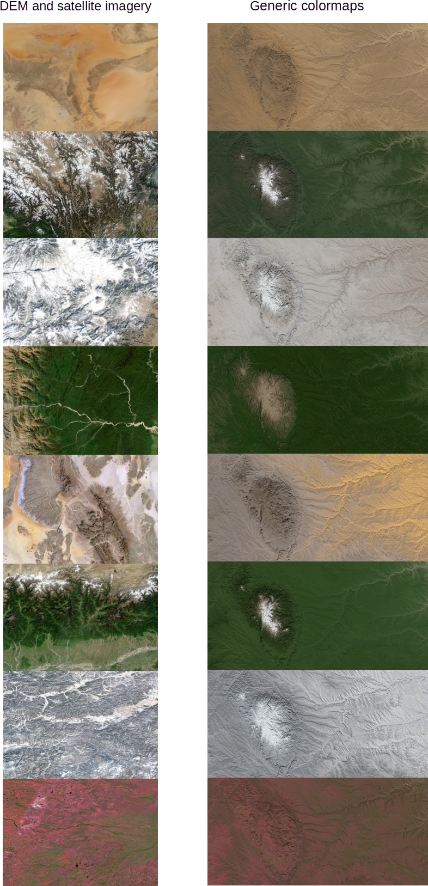

# SatColorLUT
A python script to generate color lookup table for heightmaps based on
earth DEM and true color data.

https://github.com/otto-link/SatColorLUT/assets/121820229/ef3f025a-f239-4a04-a4ae-632f6f2de0d4

## License

This project is licensed under the GNU General Public License v3.0.

## Usage

To generate the trivariate (elevation, gradient components) colormaps
use the python script `generate_clut.py`:

``` bash
python3 generate_clut.py
```

To use the colormap on a test heightmap use the python script `generate_clut.py`:

``` bash
python3 apply_clut.py
```

Visit https://worldview.earthdata.nasa.gov to retrieve DEM and true
color data of the earth surface.

## How it works

Like that:

<p align="center">
  
</p>

